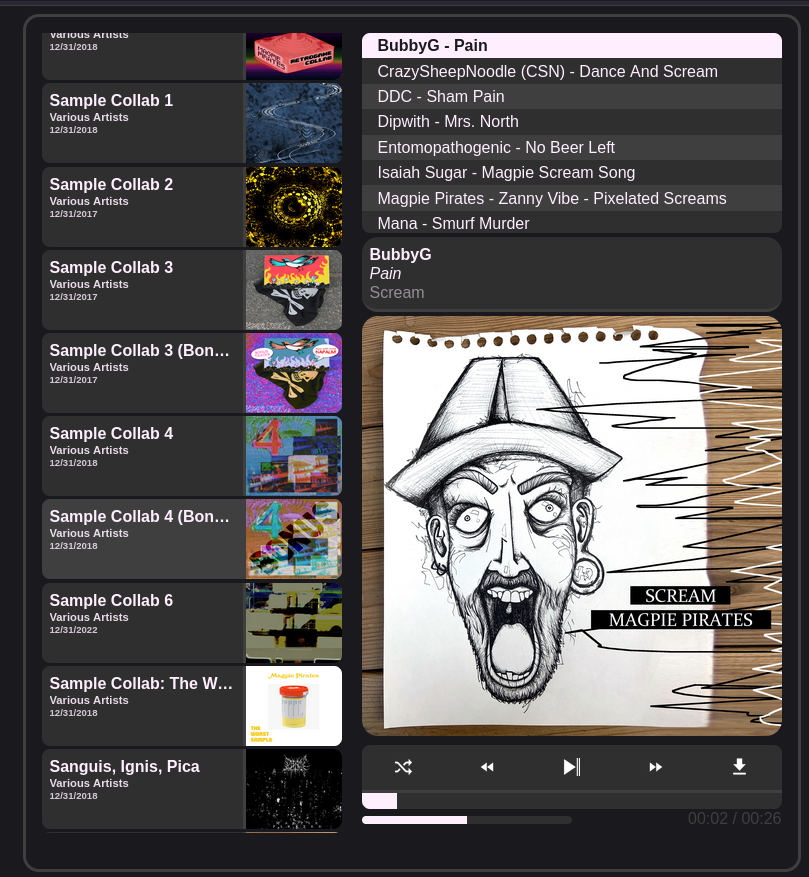

# Asayake

Asayake is a static music player that is easy to self-host. It's designed for independent artists and collectives to self-host their music catalogues without involving any 3rd parties. 



## Features
- Easy to integrate into existing sites / apps
- Works with your existing music library
- Zero dependencies
- No database or back-end
- Very little boilerplate
- 100% TypeScript
- Supports GLSL shaders for visualizing audio

Asayake works by taking a directory of albums containing MP3 files and cover art and automatically turning it into an organized static, web app. Think Spotify / Bandcamp for a personal / collective set of albums. 
> [!NOTE]  
> The resulting web app can be hosted on any static file or object storage server. There is no back-end code to deal with so it's very easy to host. 

The flagship use case is the collection of collaborative albums by the [Magpie Pirates](https://magpiepirates.com/) community. 

# Setup

## Set up the tracks

Put the albums (audio files) in some directory like `./data`. 

You don't have to put the audio files in this repo directory but it makes it easier. 

The `.gitignore` file ignores `data*` so it's pretty safe to put it here. 

You might have a structure like this:
```
data/
-- album 1/
---- track 1.mp3
---- track 2.mp3
---- cover.png
-- album 1/
---- track 1.mp3
---- track 2.mp3 
---- cover.png
```

## Bun

This project was written for `bun`; an alternative to NodeJS, NPM, TSC and more. Its super fast and easy to work with. 

[Install Bun](https://bun.com/docs/installation)

[More on Bun](https://bun.com/)

> [!NOTE]  
> This will likely work with NodeJS / NPM / TSC as well.

## Install dependencies

```sh
bun install
```
> [!NOTE]  
> This project currently has no real dependencies, but you will need the `@types/bun` package to avoid compiler warnings.

## Ripper

Run the ripper tool to extract metadata from the mp3 files.
```sh
bun tools/ripper.ts <dir>
```

This will output metadata JSON files to `./dist/metadata`.

## Generate Playlist List

A "playlist list" is a collection of playlists in JSON format. 

We can automatically generate a playlist list after running the main `ripper` script:

```sh
bun tools/auto-playlist.ts
```

This will make a `./dist/metadata/playlists.json` file which automatically contains all of the albums in your collection.

> [!NOTE]  
> This is optional but allows for Asayake to handle playlist navigation.

> [!IMPORTANT]
> The demo code assumes that you complete this step.

## Compile

Now we will run the `build` command which will: 
- Compile the TypeScript to `./dist`.
- Take the files we have written to `./dist` and move them to an `./<dir>/asa` directory. 
- Move the files in `<res?>` (defaults to `./res`) to the `./<dir>/asa` directory.

```sh
bun tools/build.ts <dir> <res?>
```

Where `<dir>` is the same directory we ran the ripper on.

The `<res?>` parameter is optional and allows for overriding the static resource directory with your own.

## Serve

The `<dir>` we've been using is now ready to serve. 

The files here could be put on a file or object storage server.

For testing, we will serve it locally

```sh
bunx http-server <dir>
```

Navigate your browser to [`http://localhost:8080`](http://localhost:8080) to view the player.

## Deploy

If everything looks good locally, the files in `<dir>` can now be uploaded to a server. Static file servers or object storage work best, but you can also use Apache or NGINX. 

# Usage

## Configuration

The `Asa` class constructor takes a config like this: 

```ts
// Configuration for Asa player
type AsaConfig = {
  // Prefix path for audio and image files
  // This can be a relative or absolute path to another server
  pathPrefix: string;
  // The HTML element to mount the player into
  playerElement: HTMLElement;
  // Optional HTML element to mount the playlist into
  playlistListElement?: HTMLElement;
  // Enable or disable logging (default: false)
  log?: boolean;
};
```

For example:
```js
const asaConfig = {
  pathPrefix: '../',
  playerElement: document.getElementById('asa-player-container'),
  playlistListElement: document.getElementById('asa-playlist-list-container'),
  log: true,
};
const asa = new Asa(asaConfig);
```

## Master Track List

The master track list is a `metadata.json` file that contains a single instance of a `MasterList` type object.

```ts
type AsaTrackMeta = {
  title: string; // The track title
  artist: string; // The list of artists
  albumTitle: string; // The album name
  albumDate: Date; // The date the album was released
  albumImageUri: string; // The URL to the album image
  audioUri: string; // The URL to the track
  duration?: number; // The duration of the track in seconds
  size?: number; // The size of the track in bytes
  bitRate?: number; // The bit rate of the track in kbps
}

type AsaMasterList = {
  [key: string]: TrackMeta;
};
```

An example `metadata.json` might look like:
```json
{
  "10007019": {
    "title": "The Moss Covers the Earth",
    "artist": "Andreji Rublev",
    "albumTitle": "Sample Collab 5",
    "albumDate": "2019-01-01T00:00:00.000Z",
    "albumImageUri": "Magpie Pirates - Sample Collab 5/cover.png",
    "audioUri": "Magpie Pirates - Sample Collab 5/Andreji Rublev - Sample Collab 5 - 01 The Moss Covers the Earth.mp3",
  },
  "13835280": {
    "title": "Admirals Of Industry",
    "artist": "Deepsurface",
    "albumTitle": "Industrial Music For Industrial People",
    "albumDate": "2019-01-01T00:00:00.000Z",
    "albumImageUri": "Magpie Pirates - Industrial Music For Industrial People/cover.png",
    "audioUri": "Magpie Pirates - Industrial Music For Industrial People/Deepsurface - Industrial Music For Industrial People - 04 Admirals Of Industry.mp3",
  },
  "14389788": {
    "title": "Ghost in the Machine",
    "artist": "TRBLMKR",
    "albumTitle": "Ministry of Magpies",
    "albumDate": "2021-01-01T00:00:00.000Z",
    "albumImageUri": "Magpie Pirates - Ministry of Magpies/cover.png",
    "audioUri": "Magpie Pirates - Ministry of Magpies/TRBLMKR - Ministry of Magpies - 02 Ghost in the Machine.mp3",
  },
  ...
}
```

There is only one `metadata.json` master list. Playlists reference entries in this list.

While this file can be written manually, the typical workflow is to generate it with `tools/ripper.ts`.

## Playlists

A "playlist" can represent a set of mostly unrelated songs or a cohesive album. 

An `AsaPlaylist` object is simply an array of strings where every entry is a key of the `MasterList` object.

A playlist might look like this:
```ts
const playlist = [
  '10007019',
  '13835280',
  '14389788',
];
```

## Minimal Example

```ts
// Create our playlist
const playlist = [
  '10007019',
  '13835280',
  '14389788',
];
// Create a new config
// Assumes these elements exist
const asaConfig = {
  pathPrefix: '../',
  playerElement: document.getElementById('asa-player-container'),
  log: true,
};
// Create a new instance of asa
const asa = new Asa(asaConfig);
// call `yeet` to start Asayake 
// We can call this again whenever we want to load a new playlist
asa.yeet(playlist);
```

## Playlist Lists

Asayake can also manage and render a list of playlists for you. This is an optional feature. Simply omitting the `playlistListElement` from your config will prevent Asayake from handling playlists. 

A playlist list type is defined as:
```ts
type AsaPlaylistList = {
  [key: string]: AsaPlaylist;
};
```

## Customization

Asayake exposes several CSS classes. Just inspect the `asa-player` element to see them all. 
All CSS classes used by Asayake are prefixed with `asa-*`.

When Asayake is currently playing a track the `asa-player` element will get the `asa-playing` class. You can use this to change the CSS:
```css
/* Highlights on play */
.asa-playing .asa-pp-button {
  background: red;
}
```

When a track in the `asa-playlist` element is selected, the given `asa-track` element will get the `asa-track-playing` class. You can use this to highlight the current track:
```css
.asa-track-playing {
  background: red;
}
```

## Shaders

The GLSL shaders are defined in the `./src/shaders.ts` file. 

A shader type is defined like this:
```ts
// Shaders consist of vertex and fragment shader source code
type AsaShader = {
  vsSource: string;
  fsSource: string;
}
```

Adding a new shader consists of 2 steps:
1. Write your shader into the shader file
2. Modify the `asa.ts` code to include your shader

Shaders are added to Asayake via the `modeMap` property of the `Asa` class:
```ts
private modeMap = [
  { fftSize: 32, shader: shaders.nothing },
  { fftSize: 2048, shader: shaders.spectrumAnalyzer },
  { fftSize: 32, shader: shaders.stereoColor },
  { fftSize: 32, shader: shaders.stereoCAFull },
];
```
> [!TIP]  
> You must rebuild the project to see the new shaders!
